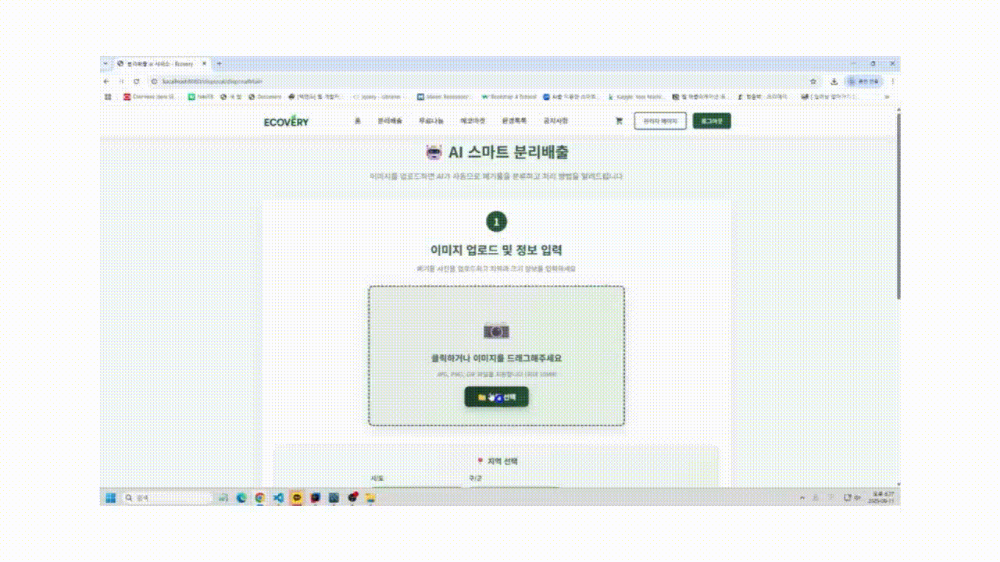

# ♻️ Ecovery ♻️

## 📌 목차
1. [프로젝트 소개](#-프로젝트-소개)
2. [팀원 소개](#-팀원-소개)
3. [개발 환경](#-개발-환경)
4. [다이어그램](#-다이어그램)
5. [기능 설명](#-기능-설명)
6. [개선 사항](#-개선-사항)

 

## 📄 프로젝트 소개
**Ecovery**는 서울시의 문화예술 정보를 제공하고 관람평 게시판을 통해 사용자들이 원하는 문화예술을 선택할 수 있도록 돕는 플랫폼입니다.
  * 서울시에서 진행되고 있는 모든 문화예술 정보를 확인할 수 있습니다.
  * 관람평 게시판에서 실제 관람객들이 남긴 관람 후기를 보고 다른 사용자가 원하는 문화예술을 선택할 때 도움을 받을 수 있습니다.
  * 관람평 게시판의 댓글을 통해 다른 사용자와 소통하며 문화적 경험을 넓힐 수 있습니다.

개발 기간 : 2025.07.07 ~ 2025.08.08

 

## 🙋 팀원 소개
<table>
 <tr>
  <th>노유경</th>
  <th>방희경</th>
  <th>이연수</th>
  <th>이지혜</th>
  <th>오세희</th>
 </tr>
 <tr>
  <td align="center"></td>
  <td align="center"></td>
  <td align="center"></td>
  <td align="center"></td>
  <td align="center"></td>
 </tr>
 <tr>
  <td>AI 데이터 라벨링 소셜 로그인 기능 환경톡톡·공지사항 게시판 CRUD</td>
  <td>AI 데이터 라벨링 로그인, 회원가입 마이페이지 관리자 페이지 백엔드</td>
  <td>AI 데이터 라벨링 무료나눔 게시판 CRUD 댓글 기능</td>
  <td>AI 데이터 라벨링 AI 모델 학습 분리배출 게시판 관리자 페이지 프론트엔드</td>
  <td>AI 데이터 라벨링 에코마켓 게시판 CRUD 주문/결제 페이지 PortOne 결제 API 연동</td>
 </tr>
</table>

 

## 🔧 개발 환경

 
  <h4>Back-End</h4>
  
  
  
  
   
  
  <h4>Front-End</h4>
   
    
   
  
  
   

  <h4>DB</h4>
  
   

  <h4>AI 서버</h4>
  
  
  
  
  <h4>개발환경</h4>
  
  
  
   

  <h4>Tool</h4>
  
  
  

 

## 📊 다이어그램

  
Usecase Diagram

  

    

     
     
    

    

     
     
    

    

     
     
    

    

     
     
    

  

  
ERD

  

    
  

 

## 🔍 기능 설명
### 에코마켓

 
<b>목록/상품 등록/수정 페이지</b>

 
 
<b>* 기능</b>

 
- 사용자 편의성을 고려한 페이징 처리와 검색 기능

 
- 관리자만 상품 등록과 상품 수정 가능하도록 접근 제한

 
- 상품 등록/수정 시 이미지 미리보기 기능

 
<b>주문·결제 페이지</b>

 
 
<b>* 기능</b>

 
- 로그인한 사용자만 장바구니/구매 버튼 사용 가능하도록 접근 제한

 
- 배송지 정보를 모두 입력하도록 유효성 검사 확인

 
- PortOne의 카카오페이 결제 API를 활용한 간편결제

 
- 주문한 상품과 배송지 정보, 결제 정보를 확인할 수 있는 주문완료 페이지

 

  
분리배출 페이지

  

    
     
  

  
관리자 페이지

  

    
     
  

  
마이 페이지

  

    
     
  

  
로그인 및 회원가입

  

    
     
  

  
환경톡톡·공지사항 게시판

  

    
     
  

  
무료나눔 게시판

  

    
     
  

  
에코마켓 게시판

  

    
    
 관리자와 일반 사용자를 구분하여 상품 등록/수정 버튼은 관리자에게만 보이도록 설정하였습니다. 상품 상세 페이지의 '장바구니', '구매하기' 버튼은 로그인한 사용자만 접근할 수 있도록 설정하였습니다. 결제 시 PortOne에서 제공하는 카카오페이 간편 결제 테스트 버전을 사용하여 실제 결제와 동일하게 진행되도록 구현하였습니다.

     
  

 

## ⏳ 개선 사항
  * 포인트 기능을 추가하여 결제 시 포인트 차감하여 결제할 수 있도록 기능 추가 필요
  * 판매 중단 상품일 경우 사용자의 상세 페이지 접근 자체를 제한하거나 썸네일을 흑백 처리하여 사용자 편의성 개선 필요
  * AI 사물 인식의 학습 분류를 세분화하여 사용자가 세부 항목을 선택할 때 가장 비슷한 항목을 추천하는 기능 추가 필요
